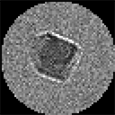
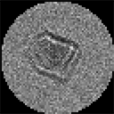
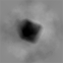

# phaseimaging

## Introduction
This library provides a variety of functions related to phase imaging. Additionally, classes and their associated methods are included for if an object-oriented approach is preferred. Some of the included functions and methods can be used to process experimental images, but I have also included functions to simulate these images. For experimental data, pre-processing will be required for meaningful results. In the future, I will add image registration and other preprocessing functions to enable perfoming all steps after image acquisition using only this library.

Note that although I have coded most of the functions to allow for rectangular images and specimen arrays, most of my testing has used square and cubic arrays, so there is a potential for bugs if you are using rectangular arrays. Please let me know if you experience any issues with any of the functions.

## Functions
### import_specimen
Generates a 3D numpy array from a specimen file. Input format is a text file (sans the file extension) with each block of rows/columns representing a 2D slice of the binary specimen mask. Each block is separated by an empty line. Specimen files can be generated using my [random-specimen-generator](https://github.com/zac-k/random-specimen-generator) repository. One specimen file is included in the present repository as an example.

    import_specimen(specimen_file)

|  |  |  |
|---|---|---|
| Parameters: | **specimen_file**:*string* |  |
|  |  | Path of specimen file |
| Returns: | **specimen**:*ndarray* |  |
|  |  | Three-dimensional binary specimen mask. A value of `1` indicates a voxel where the specimen exists, and a value of `0` indicates a voxel where it does not. |
|  |  |  |

Note: Does not yet support rectangular (non-cubic) arrays.
### project_electrostatic_phase

Generates a phase map by projecting the electrostatic potential of the specimen in the z-direction.

    project_electrostatic_phase(specimen, accel_volt, mean_inner_potential, image_width)

|  |  |  |
|---|---|---|
| Parameters: | **specimen** : *array_like* |  |
|  |  | Three-dimensional binary specimen mask. |
|  | **accel_volt** : *float* |  |
|  |  | Electron accelerating voltage in volts. |
|  | **mean_inner_potential** : *complex float* |  |
|  |  | Constant mean inner electrostatic potential of the specimen. An imaginary component can be added for simulation of absorption. |
|  | **image_width** : *tuple*, *list* |  |
|  |  | Three element tuple or list containing the width of the specimen array in metres, in the x-, y-, and z-direction, respectively. |
| Returns: | **phase** : *ndarray* |  |
|  |  | Real, two-dimensional numpy array. The computed phase map. |

### project_magnetic_phase

Generate a phase map by projecting the magnetic vector potential of the specimen in the z-direction.

    project_magnetic_phase(specimen, mhat, magnetisation, image_width, k_kernel=None, inverse_k_squared_kernel=None)

|  |  |  |
|---|---|---|
| Parameters: | **specimen** : *array_like* |  |
|  |  | Three-dimensional binary specimen mask. |
|  | **mhat** : *tuple*, *list* |  |
|  |  | Magnetisation direction. A vector pointing in the direction of uniform magnetisation of the specimen. The length of this vector has no effect. It is advisable to use a unit vector for clarity. |
|  | **magnetisation** : *float* |  |
|  |  | Magnitude of the uniform magnetisation in A/m. |
|  | **image_width** : *tuple*, *list* |  |
|  |  | Three element tuple or list containing the width of the specimen array in metres, in the x-, y-, and z-direction, respectively. |
|  | **k_kernel** : *ndarray*, *optional* |  |
|  |  | Kernel of k-space vectors at z = 0. This can be saved from previous calculations provided that the size and resolution are the same. If this parameter is omitted, it will be generated by this function. |
|  | **inverse_k_squared_kernel** : *ndarray*, *optional* |  |
|  |  | Regularised inverse k^2 array. This can be saved from previous calculations provided that the size and resolution are the same. If this parameter is omitted, it will be generated by this function using the default regularisation parameter. |
| Returns: | **phase** : *ndarray* |  |
|  |  | Real, two-dimensional numpy array. The computed phase map. |

### transfer_image

Generate in- or out-of-focus intensity or wavefield from exit phase.

    transfer_image(defocus, wavelength, image_width, phase, is_image=True)

|  |  |  |
|---|---|---|
| Parameters: | **defocus** : *float* |   |
|  |  | Microscope defocus in metres. Positive for over-focus, negative for under-focus, and zero for in-focus. |
|  | **wavelength** : *float* |  |
|  |  | Wavelength of incident beam in metres |
|  | **image_width** : *tuple*, *list* |  |
|  |  | Three element tuple or list containing the width of the specimen array in metres, in the x-, y-, and z-direction, respectively. |
|  | **phase** : *ndarray* |  |
|  |  | Exit phase of the wavefield |
|  | **is_image** : *bool*, *optional* |  |
|  |  | If true, return will be the intensity at the in- or out-of-focus plane. If false, return will be the complex wavefield at the in- or out-of-focus plane. Default is `True`. |
| Returns: | **image** : *ndarray* |  |
|  |  | Computed image. The intensity or wavefield depending on the value of `is_image`. Default is intensity. |

### retrieve_phase_tie

Retrieves the exit phase from two or three out-of-focus images using the transport-of-intensity equation (TIE).

    retrieve_phase_tie(defocus, wavelength, image_width, image_under, image_over, image_in=None, image_intensity=1, k_kernel=None, inverse_k_squared_kernel=None, reg_param=0.1, reg_param_tie=None)
                       
                       
|  |  |  |
|---|---|---|
| Parameters: | **defocus** : *float* |   |
|  |  | Microscope defocus in metres. This should be positive; this function assumes that the under-focus image is at negative defocus, and the in-focus defocus is zero.  |
|  | **wavelength** : *float* |  |
|  |  | Wavelength of incident beam in metres. |
|  | **image_width** : *tuple*, *list* |  |
|  |  | Three element tuple or list containing the width of the specimen array in metres, in the x-, y-, and z-direction, respectively. |
|  | **image_under** : *ndarray* |  |
|  |  | Under-focus image. |
|  | **image_over** : *ndarray* |  |
|  |  | Over-focus image. |
|  | **image_in** : *ndarray*, *optional* |  |
|  |  | In-focus image. If not included, the function will compute the phase from the two out-of-focus images. This requires that `image_intensity` be set to the appropriate value if it is not `1`|
|  | **image_intensity** : *float* |  |
|  |  | The incident intensity; that is, the uniform intensity of the image in the absence of a specimen. Default is unity. Has no effect if an in-focus image is included. |
|  | **k_kernel**:*ndarray*, *optional* |  |
|  |  | Kernel of k-space vectors at z = 0. This can be saved from previous calculations provided that the size and resolution are the same. If this parameter is omitted, it will be generated by this function. |
|  | **inverse_k_squared_kernel**:*ndarray*, *optional* |  |
|  |  | Regularised inverse k^2 array. This can be saved from previous calculations provided that the size and resolution are the same. If this parameter is omitted, it will be generated by this function using the default regularisation parameter. |
|  | **reg_param** : *float*, *optional* |  |
|  |  | Regularisation parameter for the division by the in-focus intensity. Default is `0.1`. Has no effect if only two images are used. |
|  | **reg_param_tie** : *float*, *optional* |  |
|  |  | Regularisation parameter for the division by k^2. Uses the default if not included. Has no effect if `inverse_k_squared_kernel` is provided. |
| Returns: | **phase** : *ndarray* |  |
|  |  | Computed phase. |

### plot_image

Plots a numpy array as an image, for visualising phase, intensity, etc.

    plot_image(image, limits=None)

|  |  |  |
|---|---|---|
| Parameters: | **image** : *ndarray* |   |
|  |  | The array to be displayed as an image. For complex arrays, only the real part will be displayed, with a warning displayed on the command line.  |
|  | **limits** : *tuple*, *list*, *optional* |  |
|  |  | Two element tuple or list containing the minimum and maximum values to be displayed. Intensities outside these limits will be clipped. If omitted, grayscale will be scaled according to the maximum and minimum values of the image array.

### save_image

Similar to `plot_image`, but saves the visualisation in an image format rather than plotting it on-screen.

    save_image(image, output_path, limits=None)

|  |  |  |
|---|---|---|
| Parameters: | **image** : *ndarray* |   |
|  |  | The array to be saved as an image. For complex arrays, only the real part will be kept, with a warning displayed on the command line.  |
|   | **output_path** : *string* |   |
|  |  | The output path of the file to be saved. The extension will determine the format (e.g., 'png', 'eps', etc.).  |
|  | **limits** : *tuple*, *list*, *optional* |  |
|  |  | Two element tuple or list containing the minimum and maximum values to be displayed. Intensities outside these limits will be clipped. If omitted, grayscale will be scaled according to the maximum and minimum values of the image array.

## Sample implementations

### Procedural style

    import phaseimaging as phim    
    
    # Import the specimen from file
    specimen = phim.import_specimen('C:/Users/zac/PycharmProjects/phaseimaging/specimen')
    
    # Project the electrostatic phase
    phase_elec = phim.project_electrostatic_phase(specimen, 300e3, -17 + 1j, (100e-9, 100e-9, 100e-9))
    
    # Set magnetisation strength
    mass_mag = 80  # emu/g
    density = 5.18  # g/cm^3
    magnetisation = mass_mag * density * 1000  # A/m
    
    # Project magnetic phase using a magnetisation vector in the x-direction
    phase_mag = phim.project_magnetic_phase(specimen,
                                        (1,0,0),
                               magnetisation,
                                        (100e-9, 100e-9, 100e-9))
    # Combine the two components of the phase
    phase = phase_mag + phase_elec
    # Plot the total phase
    phim.plot_image(phase)
    # Transfer to under- and over-focus planes
    image_under = phim.transfer_image(-8e-6, 1.96e-12, (100e-9, 100e-9), phase)
    image_over = phim.transfer_image(8e-6, 1.96e-12, (100e-9, 100e-9), phase)
    
    # Add noise to images
    image_under = phim.add_noise(image_under, 1, 0.15)
    image_over = phim.add_noise(image_over, 1, 0.15)
    
    # Compute the longitudinal derivative of the intensity
    derivative = phim.intensity_derivative(image_under, image_over, 8e-6)
    
    # Retrieve the phase
    phase_ret = phim.retrieve_phase_tie(1.96e-12, (100e-9, 100e-9), derivative)
    
    # Plot the intensity images and retrieved phase
    phim.plot_image(image_under, limits=[0, 2])
    phim.plot_image(image_over)
    phim.plot_image(phase_ret, limits=[-3,3])

### Object-oriented style

    import phaseimaging as phim    
    
    # Set magnetisation strength
    mass_mag = 80  # emu/g
    density = 5.18  # g/cm^3
    magnetisation = mass_mag * density * 1000  # A/m
    
    # Build specimen
    specimen = phim.Specimen(width = (100e-9, 100e-9, 100e-9),
                             mean_inner_potential=-17+1j,
                             magnetisation=magnetisation,
                             mhat=(1, 0, 0),
                             specimen_file='C:/Users/zac/PycharmProjects/phaseimaging/specimen')
    
    # Initialise phase and beam
    phase = phim.Phase(resolution=specimen.resolution[0:2], width=specimen.width[0:2]) #phim.project_electrostatic_phase(specimen, 300e3, -17 + 1j, (100e-9, 100e-9, 100e-9))
    beam = phim.Beam(phim.accel_volt_to_lambda(300e3))
    
    # Project the electrostatic and magnetic phases
    phase.project_electrostatic(specimen, beam)
    phase.project_magnetic(specimen, beam)    
    
    # Plot phase
    phim.plot_image(phase.image)
    
    # Generate through-focal series of intensities and compute derivative
    through_focal_series = phim.ThroughFocalSeries(phase.resolution, phase.width, [-8e-6, 0, 8e-6])
    through_focal_series.transfer_images(phase, beam)
    through_focal_series.add_noise(0.05)
    through_focal_series.compute_derivative()
    
    # Use aliases for intensities, for brevity
    image_under = through_focal_series.intensities[0]
    image_over = through_focal_series.intensities[2]
    
    # Retrieve phase
    phase_ret = phim.Phase(resolution=specimen.resolution[0:2], width=specimen.width[0:2])
    phase_ret.retrieve_phase_tie(through_focal_series, beam)
    
    # Plot intensities and retrieved phase
    phim.plot_image(image_under.image, limits=[0, 2])
    phim.plot_image(image_over.image)
    phim.plot_image(phase_ret.image, limits=[-3,3])
    
### Output

   