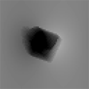
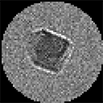
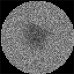
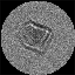
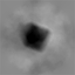

## Sample implementations

Here are two different implementations (procedural and object-oriented) of the same simulation and reconstruction process, to help you get started with using this library. These scripts load a specimen from the included specimen file, project the electrostatic and magnetic phases, simulate a through-focal series of intensities, retrieve the phase using the TIE, compare the exact and retrieved phases using a normalised root-mean-square error metric, and plot all the relevant images.


### Procedural style
```python
import phaseimaging as phim
# Import the specimen from file
specimen = phim.import_specimen('../../specimen')

# Set the physical conditions
accelerating_voltage = 300e3
mean_inner_potential = -17 + 1j
specimen_array_dimensions = (100e-9, 100e-9, 100e-9)
mhat = (1, 0, 0)

# Project the electrostatic phase
phase_elec = phim.project_electrostatic_phase(specimen,
                                              accelerating_voltage,
                                              mean_inner_potential,
                                              specimen_array_dimensions)

# Set magnetisation strength
mass_mag = 80  # emu/g
density = 5.18  # g/cm^3
magnetisation = mass_mag * density * 1000  # A/m

# Project magnetic phase using a magnetisation vector in the x-direction
phase_mag = phim.project_magnetic_phase(specimen, mhat, magnetisation, specimen_array_dimensions)

# Combine the two components of the phase
phase = phase_mag + phase_elec

# Set the imaging parameters
wavlen = phim.accel_volt_to_lambda(accelerating_voltage)
image_dimensions = specimen_array_dimensions[0:2]
defocus = 8e-6
noise_level = 0.15

# Transfer to under- and over-focus planes
image_under = phim.transfer_image(-defocus, wavlen, image_dimensions, phase)
image_in = phim.transfer_image(0, wavlen, image_dimensions, phase)
image_over = phim.transfer_image(defocus, wavlen, image_dimensions, phase)

# Add noise to images and apply apodisation
image_under = phim.apodise(phim.add_noise(image_under, 1, noise_level))
image_in = phim.apodise(phim.add_noise(image_in, 1, noise_level))
image_over = phim.apodise(phim.add_noise(image_over, 1, noise_level))

# Compute the longitudinal derivative of the intensity
derivative = phim.intensity_derivative(image_under, image_over, defocus)

# Retrieve the phase
phase_ret = phim.retrieve_phase_tie(wavlen, image_dimensions, derivative, image_in)
phase_ret = phim.remove_offset(phase_ret)
phim.normalised_rms_error(phase, phase_ret, display=True)

# Plot the phases and intensity images
phim.plot_image(phase, limits=[-3, 3])
phim.plot_image(image_under, limits=[0, 2])
phim.plot_image(image_in, limits=[0, 2])
phim.plot_image(image_over, limits=[0, 2])
phim.plot_image(phase_ret, limits=[-3, 3])
```

[Procedural Sample Code](procedural_sample_code.py)

### Object-oriented style

```python
import phaseimaging as phim
import copy

# Set magnetisation strength
mass_mag = 80  # emu/g
density = 5.18  # g/cm^3
magnetisation = mass_mag * density * 1000  # A/m

# Build specimen
specimen = phim.Specimen(width=(100e-9, 100e-9, 100e-9),
                         mean_inner_potential=-17+1j,
                         magnetisation=magnetisation,
                         mhat=(0.707, 0.707, 0),
                         specimen_file='../../specimen')

# Initialise phase and beam
phase = phim.Phase(resolution=specimen.resolution[0:2], width=specimen.width[0:2], name="Total Phase")
beam = phim.Beam(phim.accel_volt_to_lambda(300e3))

# Project the electrostatic and magnetic phases. Store a deep copy
# of the magnetic component for computing the error later.
phase.project_magnetic(specimen, beam)
phase_mag = copy.deepcopy(phase)
phase_mag.name = "Exact Magnetic Phase"
phase.project_electrostatic(specimen, beam)

# Set noise level and defoci.
noise_level = 0.01
defoci = [-8e-6, 0, 8e-6]

# Generate through-focal series of intensities and compute derivative.
through_focal_series = phim.ThroughFocalSeries(phase.resolution, phase.width, defoci=defoci)
through_focal_series.transfer_images(phase, beam)
through_focal_series.add_noise(noise_level)
through_focal_series.compute_derivative()

# Apodise images in through-focal series
through_focal_series.apodise()

# Retrieve the phase and compute the total error.
phase_ret = phim.Phase(resolution=specimen.resolution[0:2], width=specimen.width[0:2], name="Retrieved Phase")
phase_ret.retrieve_phase_tie(through_focal_series, beam)
phase_ret.remove_offset()

# Rotate the specimen for extracting the magnetic phase. Include
# a small error in the x and y rotations. The z rotation can
# be adjusted after projection if desired.
specimen.rotate(angle=178, axis=0)
specimen.rotate(angle=1, axis=1)

# Project the phases in the reverse direction.
phase_reverse = phim.Phase(resolution=specimen.resolution[0:2], width=specimen.width[0:2], name="Total Reverse Phase")
phase_reverse.project_electrostatic(specimen, beam)
phase_reverse.project_magnetic(specimen, beam)

# Generate the through-focal series in the reverse direction and compute the derivative.
through_focal_series_reverse = phim.ThroughFocalSeries(phase.resolution, phase.width, defoci=defoci)
through_focal_series_reverse.transfer_images(phase_reverse, beam)
through_focal_series_reverse.add_noise(noise_level)
through_focal_series_reverse.compute_derivative()

# Retrieve the reverse direction total phase.
phase_ret_reverse = phim.Phase(resolution=specimen.resolution[0:2], width=specimen.width[0:2],
                               name="Retrieved Reverse Phase")
phase_ret_reverse.retrieve_phase_tie(through_focal_series_reverse, beam)
phase_ret_reverse.remove_offset()

# Mirror the reverse phase and use the forward and reverse total phases to obtain
# the electrostatic and magnetic components.
phase_ret_reverse.flip(axis=1)
phase_ret_elec = phim.Phase(resolution=specimen.resolution[0:2], width=specimen.width[0:2],
                            name="Retrieved Electrostatic Phase")
phase_ret_mag = phim.Phase(resolution=specimen.resolution[0:2], width=specimen.width[0:2],
                            name="Retrieved Magnetic Phase")
phase_ret_elec.image, phase_ret_mag.image = phim.separate_phase_components(phase_ret.image, phase_ret_reverse.image)

# Display errors in magnetic component and total phase.
phase_ret_mag.normalised_rms_error(phase_mag, display=True)
phase_ret.normalised_rms_error(phase, display=True)

# Use aliases for intensities, for brevity. Only "forward" intensity
# measurements will be plotted here.
image_under = through_focal_series.intensities[0]
image_in = through_focal_series.intensities[1]
image_over = through_focal_series.intensities[-1]

# Plot intensities and phases
image_under.plot(limits=[0, 2])
image_in.plot(limits=[0, 2])
image_over.plot(limits=[0, 2])
phase.plot(limits=[-3, 3])
phase_ret.plot(limits=[-3, 3])
phase_mag.plot(limits=[-3, 3])
phase_ret_mag.plot(limits=[-3, 3])
```
[Object-oriented Sample Code](object_oriented_sample_code.py)
    
### Output

    Normalised RMS error =  28.1%
    
    


[Back to Index](../index.md)